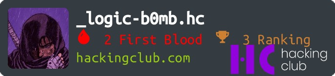

 

 

## 🤖 Sobre mim 

- :books: No momento fazendo direito na FAECA
- :technologist: Apaixonado por hacking e programação
- :3rd_place_medal: Terceiro lugar no HackingClub (plataforma de CTF brasileira)
- :space_invader: Malware desenvolvido em C++
- :spiral_calendar: Programando e hackeando desde 2022
	

 

	
	
	
	 
	

###  Linguagens e Ferramentas

	
- :globe_with_meridians: **Linguagens**:
    
    
    
     
    
    
    
	
- :computer: **Frameworks**:
	
    
    	

- :desktop_computer: **Ferramentas**:
	
    
    
    
    
    
    
    
     

- :pager: **Extras e contato**:
	

  

  

  

  

	
  

  
			
 

